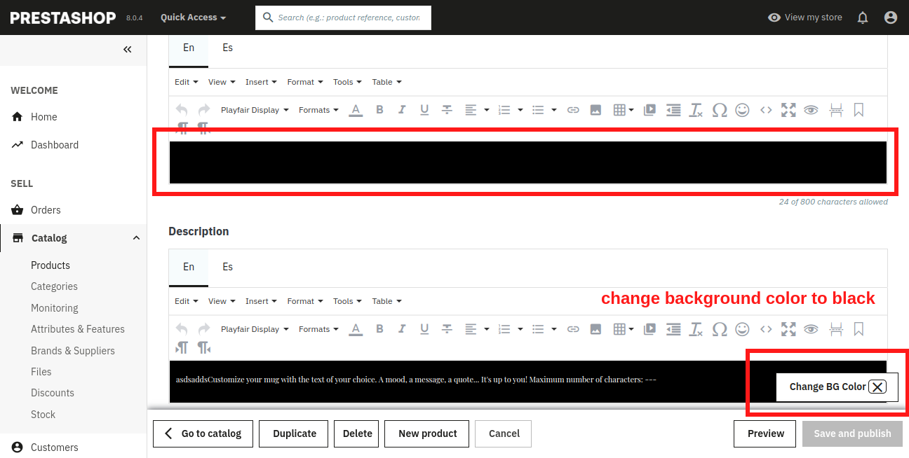
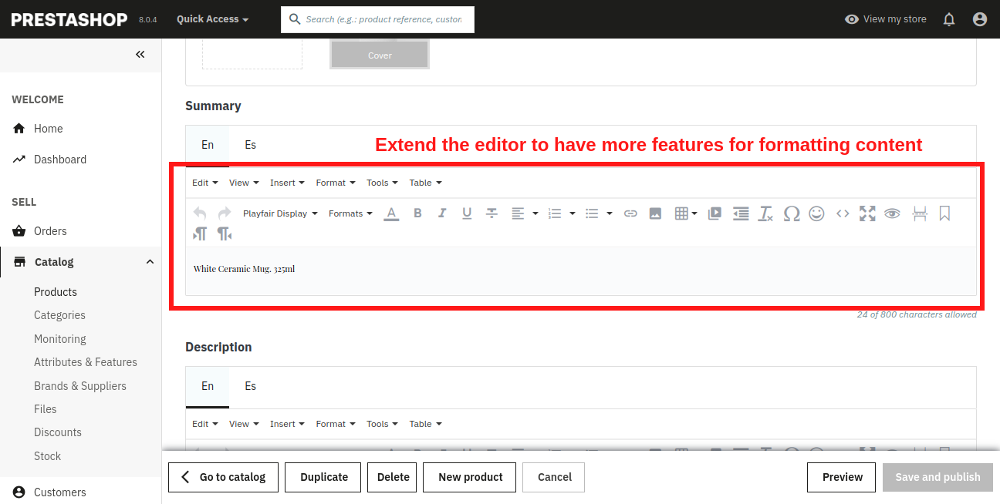

# ps-tinymce-extend

## Button to Change Background Color of text editor to Black

#### Note: Add any js file and load it under Hook - displaybackOfficeHeader

[Copy Snippet Code.txt](/Button%20to%20Change%20Background%20Color%20of%20text%20editor%20to%20Black.txt)



```JS
if (tinymce.editors.length) {
    const new_bg_color = '#000'
    $('body').append(`<button style="position: fixed; bottom: 80px; right: 15px;" class="btn-secondary cancel-button btn bg-color-change-btn">
        <i class="material-icons"></i>
        Change BG Color
        <span style="border: 1px solid; border-radius: 5px;"><i class="material-icons myclose-bg-color-change">close</i></span>
    </button>`)

    $('.myclose-bg-color-change').on('click', function () {
        $('.bg-color-change-btn').remove()
    })

    $('.bg-color-change-btn').on('click', function () {
        for (let index = 0; index < tinymce.editors.length; index++) {
            tinymce.editors[index].getBody().style.backgroundColor = new_bg_color
        }
    })
}
```

## Extend the editor functionality to have more content editing features

#### Note: File to update: ____ADMIN_FOLDER___/themes/new-theme/public/main.bundle.js
Search for below line in above main.bundle.js file and replace with this snippet [Copy Snippet Code.txt](/Extend%20the%20editor%20functionality%20to%20have%20more%20content%20editing%20features.txt)
```
const{$:Ai}=window;const ji=
```JS

[Copy Snippet Code.txt](/Extend%20the%20editor%20functionality%20to%20have%20more%20content%20editing%20features.txt)




```
/**
 * Change default icons to marerial icons
 */
function changeToMaterial() {
  var materialIconAssoc = {
    'mce-i-code': '<i class="material-icons">code</i>',
    'mce-i-none': '<i class="material-icons">format_color_text</i>',
    'mce-i-bold': '<i class="material-icons">format_bold</i>',
    'mce-i-italic': '<i class="material-icons">format_italic</i>',
    'mce-i-underline': '<i class="material-icons">format_underlined</i>',
    'mce-i-strikethrough': '<i class="material-icons">format_strikethrough</i>',
    'mce-i-blockquote': '<i class="material-icons">format_quote</i>',
    'mce-i-link': '<i class="material-icons">link</i>',
    'mce-i-alignleft': '<i class="material-icons">format_align_left</i>',
    'mce-i-aligncenter': '<i class="material-icons">format_align_center</i>',
    'mce-i-alignright': '<i class="material-icons">format_align_right</i>',
    'mce-i-alignjustify': '<i class="material-icons">format_align_justify</i>',
    'mce-i-bullist': '<i class="material-icons">format_list_bulleted</i>',
    'mce-i-numlist': '<i class="material-icons">format_list_numbered</i>',
    'mce-i-image': '<i class="material-icons">image</i>',
    'mce-i-table': '<i class="material-icons">grid_on</i>',
    'mce-i-media': '<i class="material-icons">video_library</i>',
    'mce-i-browse': '<i class="material-icons">attachment</i>',
    'mce-i-checkbox': '<i class="mce-ico mce-i-checkbox"></i>'
  };

  $.each(materialIconAssoc, function(index, value) {
    $('.' + index).replaceWith(value);
  });
}

function tinySetup(config) {
  if (typeof tinyMCE === 'undefined') {
    setTimeout(function() {
      tinySetup(config);
    }, 100);
    return;
  }

  if (!config) {
    config = {};
  }

  if (typeof config.editor_selector != 'undefined') {
    config.selector = '.' + config.editor_selector;
  }

  const all_plugins = 'align colorpicker link image filemanager table media placeholder lists advlist code table autoresize preview importcss searchreplace autolink directionality code visualblocks visualchars fullscreen image link media table charmap pagebreak nonbreaking anchor insertdatetime advlist lists wordcount charmap emoticons';
  const toolbar1 = 'undo redo | fontselect styleselect | colorpicker blocks fontfamily fontsize | bold italic underline strikethrough | align numlist bullist | link image | table media | lineheight outdent indent| forecolor backcolor removeformat | charmap emoticons | code fullscreen preview | print | pagebreak anchor | ltr rtl';
  const quickbars_selection_toolbar = 'bold italic | quicklink h2 h3 blockquote quickimage quicktable';
  const content_style = `@import url('https://fonts.googleapis.com/css2?family=Playfair+Display:ital,wght@0,400..900;1,400..900&display=swap'); body { font-family: 'Playfair Display', serif; } h1,h2,h3,h4,h5,h6 { font-family: 'Lato', sans-serif; }",font_formatsx:"Andale Mono=andale mono,times; Arial=arial,helvetica,sans-serif; Arial Black=arial black,avant garde; Book Antiqua=book antiqua,palatino; Comic Sans MS=comic sans ms,sans-serif; Courier New=courier new,courier; Georgia=georgia,palatino; Helvetica=helvetica; Impact=impact,chicago; Symbol=symbol; Tahoma=tahoma,arial,helvetica,sans-serif; Terminal=terminal,monaco; Times New Roman=times new roman,times; Trebuchet MS=trebuchet ms,geneva; Verdana=verdana,geneva; Webdings=webdings; Wingdings=wingdings,zapf dingbats`;

  var default_config = {
    selector: '.rte',
    plugins: all_plugins,
    browser_spellcheck: true,
    toolbar: "undo redo | accordion accordionremove | blocks fontfamily fontsize | bold italic underline strikethrough | align numlist bullist | link image | table media | lineheight outdent indent| forecolor backcolor removeformat | charmap emoticons | code fullscreen preview | save print | pagebreak anchor codesample | ltr rtl | formatselect",
    quickbars_selection_toolbar: quickbars_selection_toolbar,
    toolbar_mode: 'sliding',
    toolbar1: toolbar1,
    toolbar2: '',
    external_filemanager_path: baseAdminDir + 'filemanager/',
    filemanager_title: 'File manager',
    external_plugins: {
      filemanager: baseAdminDir + 'filemanager/plugin.min.js'
    },
    language: iso_user,
    content_style: lang_is_rtl === '1' ? 'body {direction:rtl;}' : content_style,
    skin: 'prestashop',
    mobile: {
      theme: 'mobile',
      plugins: ['lists', 'align', 'link', 'table', 'placeholder', 'advlist', 'code'],
      toolbar:
        'undo code colorpicker bold italic underline strikethrough blockquote link align bullist numlist table formatselect styleselect',
    },
    menubar: 'edit insert format',
    statusbar: false,
    relative_urls: false,
    convert_urls: false,
    entity_encoding: 'raw',
    extended_valid_elements: 'em[class|name|id],@[role|data-*|aria-*]',
    valid_children: '+*[*]',
    valid_elements: '*[*]',
    init_instance_callback: 'changeToMaterial',
    rel_list: [{title: 'nofollow', value: 'nofollow'}]
  };

  if (typeof window.defaultTinyMceConfig !== 'undefined') {
    Object.assign(default_config, window.defaultTinyMceConfig);
  }

  $.each(default_config, function(index, el) {
    if (config[index] === undefined) config[index] = el;
  });

  var plugins_arr = config['plugins'].split(/[ ,]/);
  var old_plugins_array = ['iespell', 'inlinepopups', 'style', 'xhtmlxtras', 'safari'];
  $.each(plugins_arr, function(index, data) {
    if (data == 'advhr') plugins_arr[index] = 'hr';
    else if (data == 'advlink') plugins_arr[index] = 'link';
    else if (data == 'advimage') {
      plugins_arr[index] = 'image';
      plugins_arr.push('filemanager');
    } else if (data == 'emotions') plugins_arr[index] = 'emoticons';
    else if (old_plugins_array.indexOf(data) >= 0) {
      plugins_arr.splice(index, 1);
    }
  });

  var plugins = plugins_arr.join(',');

  config.plugins = plugins;

  // Change icons in popups
  $('body').on('click', '.mce-btn, .mce-open, .mce-menu-item', function() {
    changeToMaterial();
  });

  tinyMCE.init(config);
}
```
